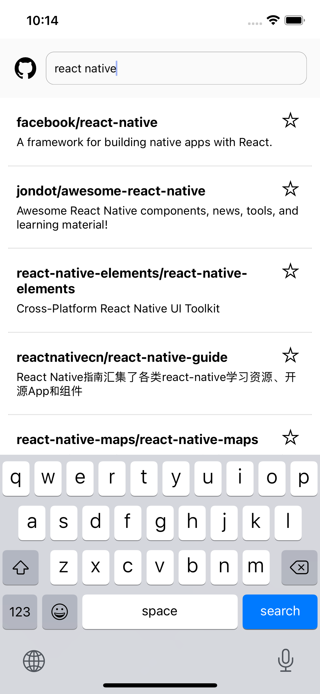
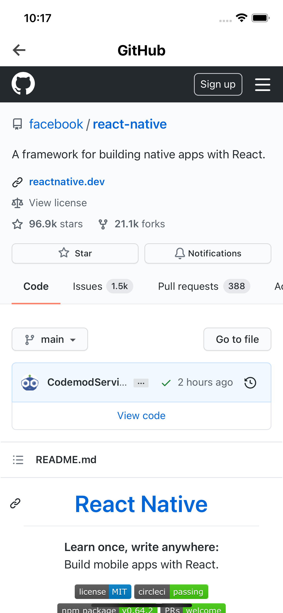
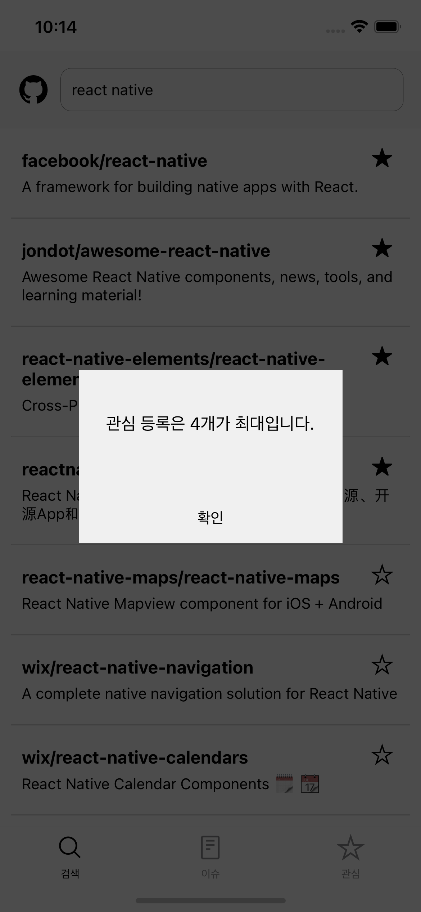
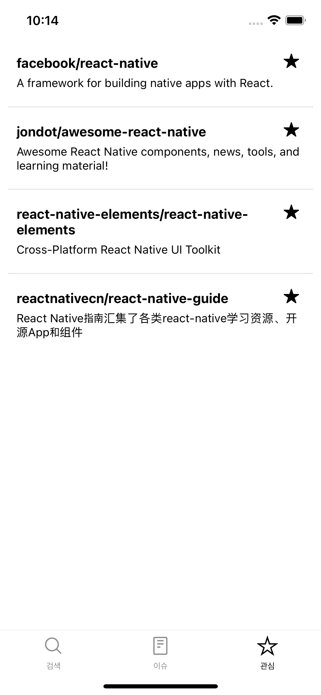
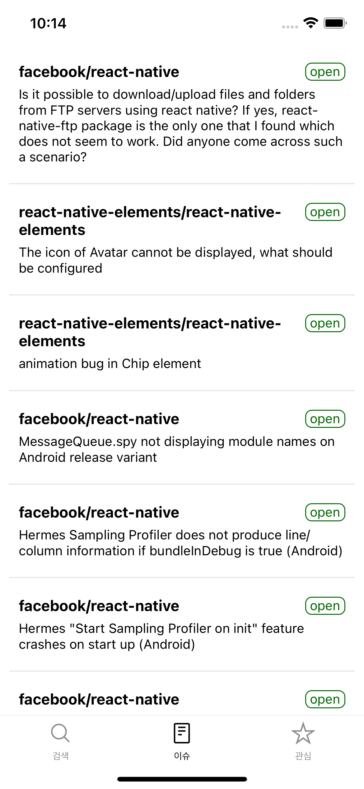
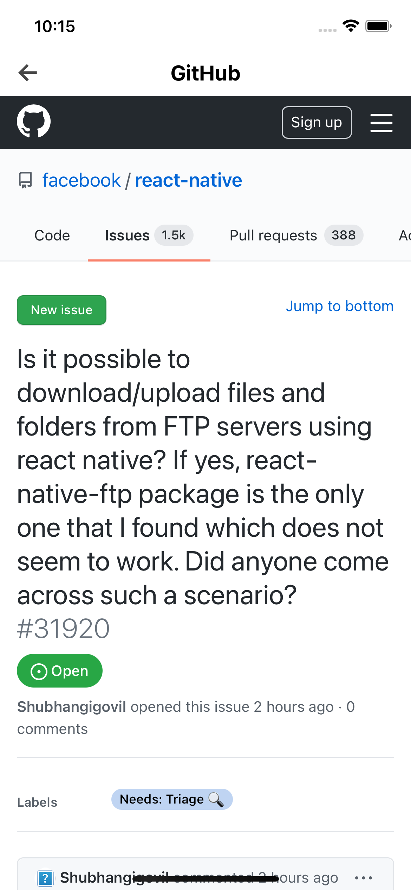

### **개발 환경**

- React Native 0.64
- React Navigation v5
- Redux Toolkit
- async-storage

### **화면별 상세 정보**

1. **원하는 저장소 검색**
2. **저장소 상세페이지**

 &nbsp;&nbsp;&nbsp;&nbsp;


---

1. **관심 저장소 등록은 최대 4개**
2. **관심 저장소 목록**

 &nbsp;&nbsp;&nbsp;&nbsp;


---

1. **관심 저장소의 이슈 모음**
2. **이슈 상세페이지**

 &nbsp;&nbsp;&nbsp;&nbsp;


---

### **실행**

- .env 파일 생성(.env.template 참조)

```
 "scripts": {
    "android": "react-native run-android",
    "ios": "react-native run-ios",
    "start": "react-native start",
  },

  // scripts 이용한 merto 서버 및 각 OS 실행
```
